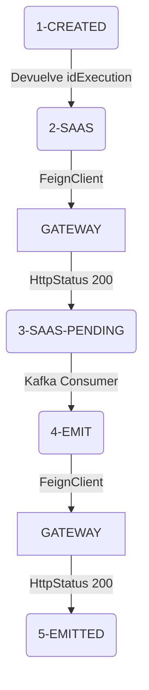
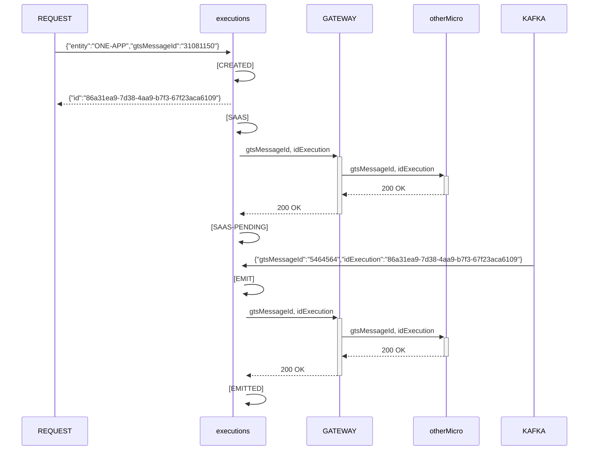

# Documentación Executions

# Flujo de estados



# Diagrama Entidad Relación

```mermaid

 erDiagram;
	  executions ||--|{ executions_status : "has";
	  executions ||--|| entity : "contains";
	  executions_status ||--|| status : "contains";
	  entity ||--|{ entity_status : "has";
	  status ||--|{ entity_status : "has";
```

# Diagrama de secuencia

