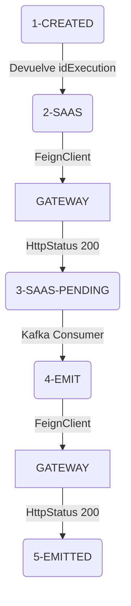

# Documentación Executions

# Flujo de estados

```mermaid

 graph TD;
    A(1-CREATED) -->|Devuelve idExecution| B(2-SAAS);
    B -->|FeignClient| C[GATEWAY];
    C -->|HttpStatus 200| D(3-SAAS-PENDING);
    D -->|Kafka Consumer| E(4-EMIT);
    E -->|FeignClient| F[GATEWAY];
    F -->|HttpStatus 200| G(5-EMITTED);
```
