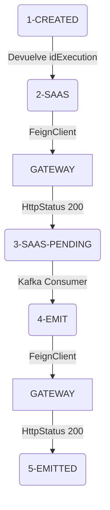
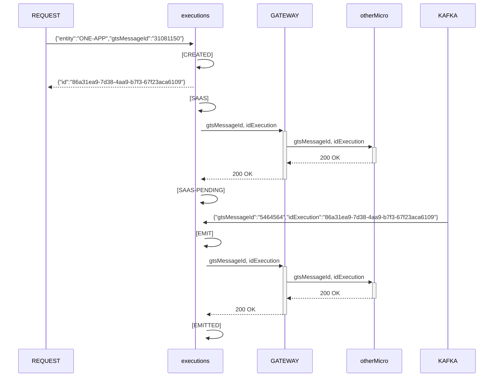

# Documentación Executions

# Flujo de estados



# Diagrama Entidad Relación

```mermaid

 erDiagram;
	  executions ||--|{ executions_status : "has";
	  executions ||--|| entity : "contains";
	  executions_status ||--|| status : "contains";
	  entity ||--|{ entity_status : "has";
	  status ||--|{ entity_status : "has";
```

# Diagrama de secuencia



# Ejemplo petición REST

 - Crear ejecución


 	POST: http://localhost:8080/executions
	```
 	{
	  "entity": "ONE-APP",
	  "gtsMessageId": "31081150"
	}
	```
	
	Ejemplo respuesta:
	```
	{
	    "id": "86a31ea9-7d38-4aa9-b7f3-67f23aca6109"
	}
	```
 - Detalles ejecución


  	GET: http://localhost:8080/executions/86a31ea9-7d38-4aa9-b7f3-67f23aca6109
	
	Ejemplo respuesta:
	```
	{
	    "id": "28ba1c44-22f2-4267-9217-bcb1a3d85c88",
	    "entity": "ONE-APP",
	    "lastExecute": "EMITTED",
	    "gtsMessageId": "54641313",
	    "globalOperationId": "null",
	    "historic": [
		{
		    "execution": {
			"status": "CREATED",
			"timestamp": "2022-08-30T10:45:23.61018",
			"gtsMessageId": "30081045"
		    }
		},
		{
		    "execution": {
			"status": "SAAS",
			"timestamp": "2022-08-30T10:45:23.621005",
			"gtsMessageId": "30081045"
		    }
		},
		{
		    "execution": {
			"status": "SAAS-PENDING",
			"timestamp": "2022-08-30T10:45:23.644017",
			"gtsMessageId": "30081045"
		    }
		},
		{
		    "execution": {
			"status": "EMIT",
			"timestamp": "2022-08-30T10:47:16.874654",
			"gtsMessageId": "54641313"
		    }
		},
		{
		    "execution": {
			"status": "EMITTED",
			"timestamp": "2022-08-30T10:47:16.887653",
			"gtsMessageId": "54641313"
		    }
		}
	    ]
	}
	```
	
# Mensajes KAFKA

 - Producer
 ```
 {
   "gtsMessageId":"31081150",
   "idExecution":"86a31ea9-7d38-4aa9-b7f3-67f23aca6109",
   "status":"SAAS-PENDING"
 }
 ```
 
 - Consumer
  ```
{
  "gtsMessageId":"98989898",
  "idExecution":"9b5f6bae-e32e-480d-85f8-69777f5cddb5"
}
 ```


